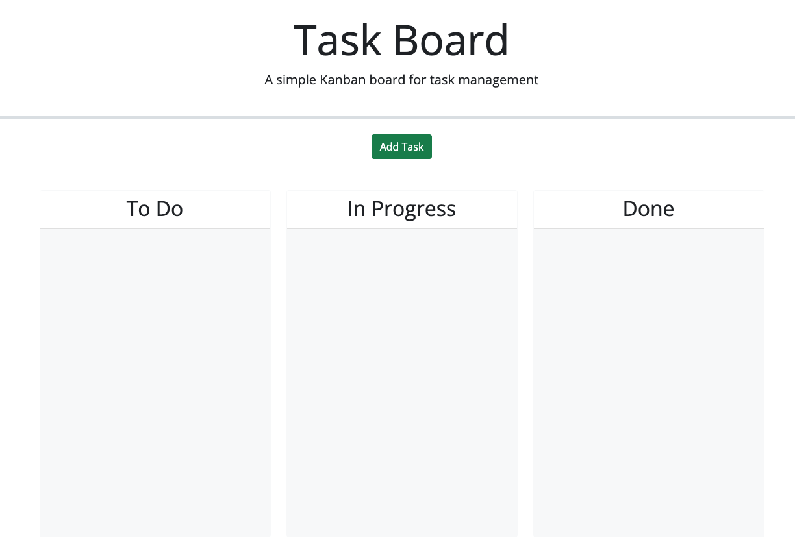

# Task Board

## Description

This task board was created with intentions of using to keep track of tasks that need to be done within a deadline/due date.
This task board will come in handy for when there are too many things that need to be done and will help complete by the DUE DATE/DEADLINE. This is important in many aspects of life so this will be very helpful to anyone. 
I have learn how to create something so simple to the user but I found it very challenging to create behind the scenes. I have learned A LOT about back-end development and have much more to learn. I hope this makes any user's life more organized and easier by keeping track of all kinds of tasks.

## Installation

No installation required! Simple click on the link below and you will be directed to this task board to use!

https://2023kgl.github.io/task-board/

## Usage

Click on Add Task then fill out the required fields.
It should drop into the To Do category. You are then able to drag and drop as needed. If you need to Delete, click on the Delete button of the card you no longer need/want.

https://github.com/2023kgl/task-board

https://2023kgl.github.io/task-board/

    
  
## Credits

I attend office hours before and after class every day of class. 
Class TA's assisted me by answering my questions. I used ChatGPT to obtain a better understanding of certain functions. I used Google and YouTube as well. The mini-challenge was also of great use.

